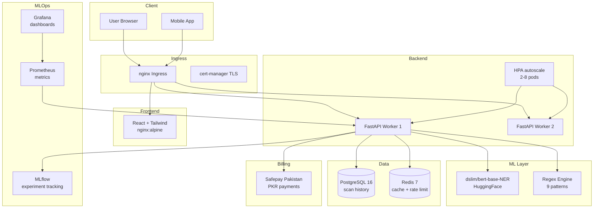

# MyCyber DLP

<div align="center">

[](https://python.org)
[](https://fastapi.tiangolo.com)
[](https://react.dev)
[](https://postgresql.org)
[](https://docs.docker.com/compose)
[](https://tailwindcss.com)
[](LICENSE)
[](https://github.com/Khan-Feroz211/MyCyber-Project/actions)

> AI-powered Data Leakage Prevention platform.
> Detects PII, credentials, and sensitive data
> in text, files, and network payloads.

</div>

---

## Architecture



---

## Features

- AI hybrid PII scanner (regex + HuggingFace NER)
- Detects: CNIC, emails, API keys, credit cards, passwords, IBANs, IP addresses, URLs with tokens
- Scans: text, files (10 MB), network payloads
- Real-time security alerts with severity scoring
- MLOps observability (MLflow + Prometheus + Grafana)
- Multi-tenant SaaS (Free / Pro / Enterprise)
- Safepay Pakistan billing (PKR payments)
- JWT auth + RBAC
- Kubernetes with HPA autoscaling
- Security headers middleware (production)
- Pre-launch pentest checklist script

---

## Tech Stack

| Layer | Technology |
|---|---|
| **Backend** | FastAPI · Python 3.11 · SQLAlchemy 2 async · Alembic · asyncpg |
| **ML** | HuggingFace Transformers · `dslim/bert-base-NER` |
| **MLOps** | MLflow · Prometheus · Grafana · DVC |
| **Auth** | JWT · bcrypt · RBAC |
| **Database** | PostgreSQL 16 |
| **Frontend** | React 18 · Vite · Tailwind CSS · Recharts · React Router v6 |
| **Billing** | Safepay Pakistan (PKR) |
| **Infra** | Docker · Kubernetes · nginx · cert-manager · GitHub Actions |

---

## Quick Start with Docker

> **Requirements:** Docker Desktop installed and running.

```bash
# 1. Clone
git clone https://github.com/Khan-Feroz211/MyCyber-Project.git
cd MyCyber-Project

# 2. Configure environment
cp .env.docker.example .env.docker
# Edit .env.docker — set POSTGRES_PASSWORD and JWT_SECRET

# 3. Start all services
make up

# 4. Open browser
open http://localhost
```

> ⏳ First run takes 3–5 minutes — the backend downloads the `dslim/bert-base-NER` model (~400 MB).

| Service | URL |
|---|---|
| **Web App** | http://localhost |
| **API Docs (Swagger)** | http://localhost:8000/docs |
| **Grafana** | http://localhost:3001 (admin / admin) |
| **MLflow** | http://localhost:5001 |
| **Prometheus** | http://localhost:9090 |

---

## Production Deployment

```bash
# 1. Provision Ubuntu 22.04 VPS (4 GB RAM minimum)

# 2. Bootstrap server (installs k3s, cert-manager, nginx ingress, UFW, fail2ban)
chmod +x scripts/server-setup.sh
sudo ./scripts/server-setup.sh

# 3. Set your domain in the ingress manifest
#    Edit k8s/ingress-prod.yaml — replace mycyber.yourdomain.com

# 4. Export required secrets
export POSTGRES_PASSWORD=strongpassword
export JWT_SECRET=64charRandomString
export GRAFANA_PASSWORD=strongpassword

# 5. Deploy
chmod +x scripts/deploy.sh
./scripts/deploy.sh
```

---

## API Endpoints

All endpoints (except `/health` and `/api/v1/auth/*`) require `Authorization: Bearer <token>`.

| Method | Path | Auth | Description |
|---|---|---|---|
| `GET` | `/health` | ❌ | Liveness probe |
| `POST` | `/api/v1/auth/register` | ❌ | Create account |
| `POST` | `/api/v1/auth/login` | ❌ | Obtain JWT token |
| `GET` | `/api/v1/auth/me` | ✅ | Current user info |
| `POST` | `/api/v1/scan/text` | ✅ | Scan plain text for PII |
| `POST` | `/api/v1/scan/file` | ✅ | Scan base64-encoded file |
| `POST` | `/api/v1/scan/network` | ✅ | Scan network payload |
| `GET` | `/api/v1/scan/history` | ✅ | Paginated scan history |
| `GET` | `/api/v1/scan/stats/summary` | ✅ | Aggregated stats |
| `GET` | `/api/v1/alerts` | ✅ | List alerts |
| `POST` | `/api/v1/alerts/acknowledge` | ✅ | Acknowledge an alert |
| `GET` | `/api/v1/billing/plans` | ❌ | Available SaaS plans |
| `POST` | `/api/v1/billing/upgrade` | ✅ | Upgrade subscription |
| `GET` | `/api/v1/billing/usage` | ✅ | Current usage stats |
| `GET` | `/metrics` | 🔒 | Prometheus metrics (internal) |

Interactive docs with live try-it-out: **http://localhost:8000/docs**

---

## SaaS Plans

| Plan | Scans / Month | Price |
|---|---|---|
| **Free** | 100 | PKR 0 |
| **Pro** | 10,000 | PKR 4,500 / month |
| **Enterprise** | Unlimited | PKR 15,000 / month |

Payments processed via [Safepay Pakistan](https://getsafepay.com).

---

## Make Commands

| Command | Description |
|---|---|
| `make up` | Start all services (detached) |
| `make down` | Stop all services |
| `make build` | Rebuild all Docker images (no cache) |
| `make logs` | Follow logs for all services |
| `make logs-backend` | Follow backend logs only |
| `make migrate` | Run Alembic DB migrations inside backend container |
| `make shell-backend` | Open bash shell inside backend container |
| `make shell-db` | Open `psql` inside postgres container |
| `make reset` | Full reset: stop, delete volumes, rebuild from scratch |
| `make prod-up` | Start production stack (4 uvicorn workers, no live-reload) |
| `make prod-down` | Stop production stack |
| `make monitoring-up` | Start only MLflow + Prometheus + Grafana |
| `make monitoring-down` | Stop monitoring services |
| `make mlflow` | Open MLflow UI (http://localhost:5001) |
| `make prometheus` | Open Prometheus UI (http://localhost:9090) |
| `make grafana` | Open Grafana UI (http://localhost:3001) |
| `make lint` | Ruff + Black format check |
| `make lint-fix` | Auto-fix ruff + black |
| `make security` | Bandit SAST scan |
| `make test` | Run pytest |
| `make test-cov` | Run pytest with coverage (≥ 60 %) |
| `make ci-local` | Run full local CI simulation |

---

## Environment Variables

Copy `.env.docker.example` → `.env.docker`. **Never commit `.env.docker`.**

| Variable | Description | Default / Example |
|---|---|---|
| `POSTGRES_USER` | PostgreSQL username | `postgres` |
| `POSTGRES_PASSWORD` | PostgreSQL password *(required)* | `s3cur3pass!` |
| `POSTGRES_DB` | Database name | `mycyber_dlp` |
| `JWT_SECRET` | HMAC signing secret ≥ 32 chars *(required)* | `openssl rand -hex 32` |
| `JWT_EXPIRE_HOURS` | Token lifetime in hours | `24` |
| `APP_ENV` | `development` or `production` | `development` |
| `LOG_LEVEL` | Python log level | `INFO` |
| `CORS_ORIGINS` | Comma-separated allowed origins | `http://localhost` |
| `NER_MODEL_NAME` | HuggingFace model identifier | `dslim/bert-base-NER` |
| `NER_MIN_CONFIDENCE` | Minimum NER confidence threshold | `0.85` |
| `USE_TRANSFORMER` | Enable HuggingFace NER | `true` |
| `MLFLOW_TRACKING_URI` | MLflow server URI | `http://mlflow:5001` |
| `SAFEPAY_SECRET_KEY` | Safepay API key | *(from Safepay dashboard)* |
| `SAFEPAY_WEBHOOK_SECRET` | Safepay webhook secret | *(from Safepay dashboard)* |
| `FRONTEND_URL` | Frontend base URL (for billing redirects) | `http://localhost` |
| `GRAFANA_USER` | Grafana admin username | `admin` |
| `GRAFANA_PASSWORD` | Grafana admin password | `admin` |

---

## Load Testing

```bash
pip install locust

# Run against your production instance
locust -f tests/load/locustfile.py \
  --host=https://mycyber.yourdomain.com

# Open Locust UI
open http://localhost:8089
```

The load test file (`tests/load/locustfile.py`) simulates two user types:

- **`MyCyberUser`** — typical user: login, clean scans, PII scans, history, stats, alerts
- **`HeavyScanUser`** — enterprise user: repeated large document scans with embedded PII

---

## Security

Run the pre-launch security checklist before going live:

```bash
chmod +x scripts/pentest-checklist.sh
./scripts/pentest-checklist.sh https://mycyber.yourdomain.com
```

Checks performed:
1. Health endpoint returns 200
2. Scan endpoint requires auth (401)
3. Alerts endpoint requires auth (401)
4. Invalid JWT rejected (401)
5. SQL injection attempt rejected (422)
6. XSS attempt rejected (401)
7. Rate limiting active (200 or 429)
8. HTTP redirects to HTTPS (301/302)
9. `X-Content-Type-Options` security header present
10. Metrics endpoint not publicly exposed

---

## Project Structure

```
MyCyber-Project/
├── backend/
│   ├── app/
│   │   ├── main.py           # FastAPI app + middleware (CORS, logging, security headers)
│   │   ├── config.py         # Pydantic settings (reads .env.docker)
│   │   ├── middleware/       # SecurityHeadersMiddleware (production)
│   │   ├── db/               # SQLAlchemy ORM models + async session
│   │   ├── routers/          # auth · scan · alerts · health · metrics · billing
│   │   ├── services/         # PII scanner, NER model, alert logic, auth, billing
│   │   └── models/           # Pydantic request/response schemas + plan config
│   ├── alembic/              # Database migration scripts
│   ├── tests/                # pytest-asyncio test suite
│   ├── requirements.txt
│   └── Dockerfile            # Multi-stage Python build
├── frontend/
│   ├── src/
│   │   ├── api/              # Axios API clients
│   │   ├── components/       # Reusable UI (StatCard, SeverityBadge, …)
│   │   ├── context/          # AuthContext (JWT + user state)
│   │   └── pages/            # Dashboard · Scan · Alerts · History · Settings
│   ├── nginx.conf            # nginx SPA + /api proxy
│   └── Dockerfile            # Multi-stage Node build → nginx runtime
├── k8s/
│   ├── backend.yaml          # Backend Deployment + Service (hardened security context)
│   ├── cert-manager.yaml     # Let's Encrypt ClusterIssuer (prod + staging)
│   └── ingress-prod.yaml     # TLS ingress for API + frontend + Grafana
├── monitoring/
│   ├── prometheus.yml        # Prometheus scrape config
│   └── grafana/              # Dashboards + provisioning
├── scripts/
│   ├── server-setup.sh       # Ubuntu 22.04 VPS bootstrap
│   ├── deploy.sh             # Idempotent Kubernetes deploy
│   └── pentest-checklist.sh  # Pre-launch security checks
├── tests/
│   └── load/
│       └── locustfile.py     # Locust load test
├── docs/
│   └── adr/
│       └── 001-hybrid-pii-scanner.md
├── docker-compose.yml        # Development stack (live-reload)
├── docker-compose.prod.yml   # Production stack (4 workers)
├── .env.docker.example       # Environment template
├── Makefile                  # Convenience commands
└── .github/workflows/ci.yml  # GitHub Actions CI (flake8 + pytest)
```

---

## Roadmap

| Status | Milestone |
|---|---|
| ✅ | Core platform: FastAPI + React dashboard, PII detection, real-time alerts |
| ✅ | JWT authentication, PostgreSQL, Alembic migrations |
| ✅ | Docker Compose (dev + prod), multi-stage builds |
| ✅ | MLflow experiment tracking + Prometheus + Grafana observability |
| ✅ | GitHub Actions CI/CD pipeline |
| ✅ | Safepay Pakistan billing (Free / Pro / Enterprise) |
| ✅ | Kubernetes manifests (backend, ingress, cert-manager) |
| ✅ | Security headers middleware + pentest checklist |
| ✅ | Locust load tests |
| 🔜 | Production launch + custom domain + SSL (Let's Encrypt) |
| 🔜 | Helm chart for one-command K8s install |

---

## Contributing

Pull requests are welcome! See [CONTRIBUTING.md](CONTRIBUTING.md) for guidelines.

---

## License

MIT — see [LICENSE](LICENSE).

---

<div align="center">
  Built with ❤️ by <a href="https://github.com/Khan-Feroz211">Khan-Feroz211</a>
</div>
