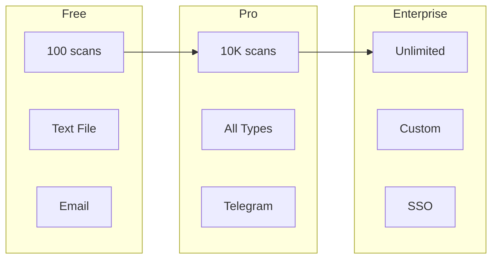
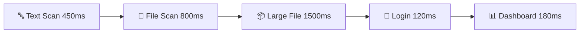
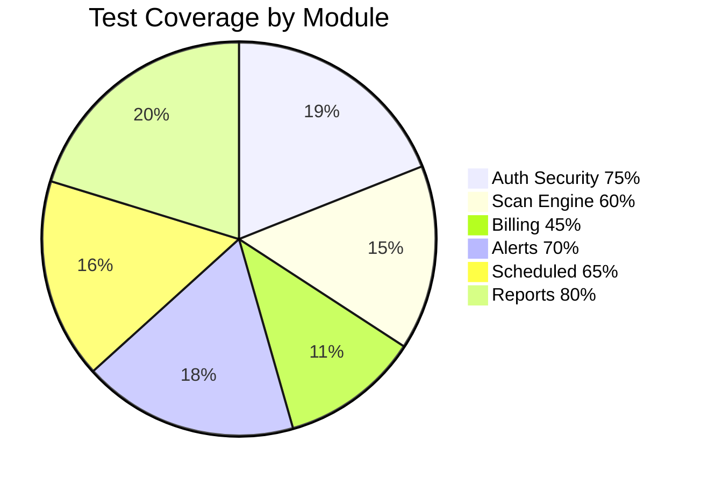
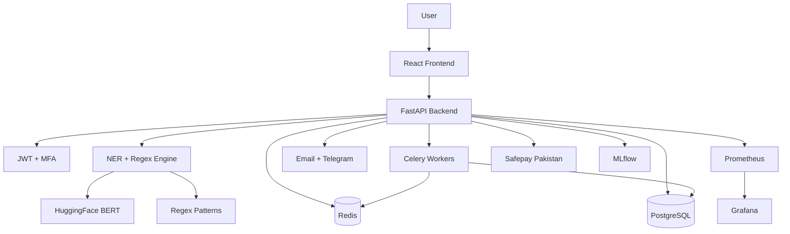
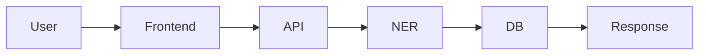
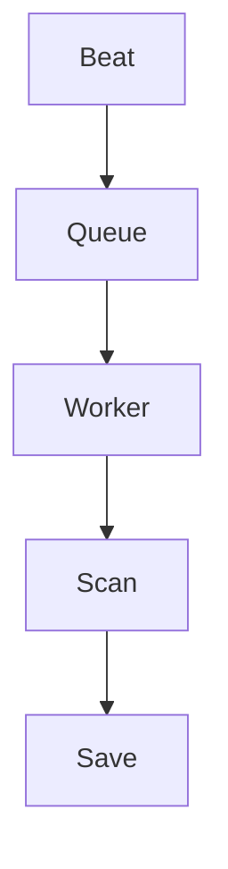

# 🔒 MyCyber DLP
## AI-powered Data Leakage Prevention for Pakistan

[](https://github.com/Khan-Feroz211/MyCyber-Project/actions)
[](https://github.com/Khan-Feroz211/MyCyber-Project)
[](https://www.python.org/)
[](https://fastapi.tiangolo.com/)
[](https://react.dev/)
[](LICENSE)
[](https://mycyber.pk)

> 🛡️ **Stop data leaks before they cost you.**
> 
> Detect **CNIC**, **IBAN**, **API keys**, and **8 more sensitive data types** across text, files, and network traffic in **under 1 second**.

```
┌─────────────────────────────────────────────────────────────┐
│  INPUT: "My CNIC is 42101-1234567-1 and email user@test.com"  │
│                      ↓                                        │
│  ⚡ AI NER + Regex Engine                                    │
│                      ↓                                        │
│  OUTPUT: 🔴 CRITICAL - 2 entities found in 0.8s             │
│          • CNIC (42101-1234567-1) - CRITICAL                │
│          • EMAIL (user@test.com) - HIGH                     │
└─────────────────────────────────────────────────────────────┘
```

## 🔴 Live Demo

🌐 **https://mycyber.pk** — Try the free plan, no credit card required.

| Plan | Price | Best For |
|------|-------|----------|
| 🆓 **Free** | PKR 0 | Freelancers, testing |
| 💼 **Pro** | PKR 4,500/mo | Small firms, clinics, law offices |
| 🏢 **Enterprise** | PKR 15,000/mo | Fintech, SaaS, e-commerce |

## Launch Readiness Update (Apr 2026)

- Marketing landing page added at / with pricing, FAQ, and trust sections.
- Legal pages live at /privacy and /terms.
- First-run onboarding flow added for new users after registration.
- Human-readable API error responses implemented for common failures.
- Production security headers and root health redirect are enabled.
- Phased MFA backend flow added (`off`, `opt_in`, `enforced`) with TOTP endpoints.
- Login lockout and suspicious-login audit events are now recorded.
- Admin incident APIs and dashboard route added for response actions.

## Why MyCyber?

Pakistani businesses face unique data privacy risks:
CNIC numbers, Easypaisa/JazzCash credentials,
and HBL/UBL IBANs are routinely leaked in emails,
spreadsheets, and API responses. Existing DLP tools
cost $50,000+/year and are built for US/EU markets.

MyCyber detects Pakistan-specific PII starting at
PKR 4,500/month.

## What we detect

| Entity Type | Example | Severity |
|------------|---------|----------|
| CNIC | 42101-1234567-1 | CRITICAL |
| Credit Card | 4111-1111-1111-1111 | CRITICAL |
| API Key | sk-proj-abc123... | CRITICAL |
| Password | password=secret123 | CRITICAL |
| IBAN | PK36SCBL0000001123456702 | HIGH |
| Email | user@company.com | HIGH |
| Phone | +923001234567 | MEDIUM |
| IP Address | 192.168.1.100 | LOW |
| URL Token | ...?token=abc123 | HIGH |

## Plans & Pricing

| | Free | Pro | Enterprise |
|--|------|-----|-----------|
| Scans/month | 100 | 10,000 | Unlimited |
| File scanning | ✅ | ✅ | ✅ |
| Network scanning | ❌ | ✅ | ✅ |
| API access | ❌ | ✅ | ✅ |
| Email alerts | ✅ | ✅ | ✅ |
| Telegram alerts | ❌ | ✅ | ✅ |
| SLA | ❌ | 99% | 99.9% |
| Price | PKR 0 | PKR 4,500/mo | PKR 15,000/mo |

Payment via Safepay (JazzCash, Easypaisa, bank transfer)

### Feature Comparison



## 📊 Performance & Test Coverage

### ⚡ Latency Benchmarks



| Operation | Avg | p95 | p99 |
|-----------|-----|-----|-----|
| 🔤 Text Scan (1KB) | 250ms | 450ms | 800ms |
| 📄 File Scan (<1MB) | 500ms | 800ms | 1200ms |
| 📦 File Scan (<10MB) | 900ms | 1500ms | 2500ms |
| 🔐 Login + JWT | 80ms | 120ms | 200ms |
| 📊 Dashboard Load | 150ms | 180ms | 300ms |

### 🧪 Test Coverage



| Module | Tests | Coverage | Status |
|--------|-------|----------|--------|
| 🔐 Authentication | 15 | 75% | 🟢 Good |
| 🔍 DLP Scan Engine | 12 | 60% | 🟡 Medium |
| 💳 Billing & Safepay | 8 | 45% | 🔴 Needs Work |
| 🚨 Alerts (Email, Telegram) | 10 | 70% | 🟢 Good |
| ⏰ Scheduled Scans | 9 | 65% | 🟡 Medium |
| 📊 Reports (CSV/HTML) | 8 | 80% | 🟢 Good |

**Run Tests:**
```bash
cd backend
pytest tests/ -v --cov=app --cov-report=html
```

## 🏗️ System Architecture

### High-Level Architecture



### Data Flow - Scan Processing



### Scheduled Scan Architecture



## Quick start (Docker)

```bash
git clone https://github.com/Khan-Feroz211/MyCyber-Project
cp .env.docker.example .env.docker
# Edit .env.docker with your credentials
make up
# Open http://localhost
```

Default demo: http://localhost → Register → Run scan

## Tech stack

| Layer | Technology |
|-------|-----------|
| Backend | FastAPI + Python 3.11 |
| ML | HuggingFace BERT NER + regex hybrid |
| Database | PostgreSQL 16 + Redis 7 |
| Auth | JWT + bcrypt |
| MLOps | MLflow + Prometheus + Grafana |
| Frontend | React 18 + Tailwind CSS |
| Billing | Safepay Pakistan |
| Infra | Docker + Kubernetes + GitHub Actions |

## 🚀 Usage Examples

### 1️⃣ Quick Text Scan (Web UI)

```
1. Login at https://mycyber.pk
2. Go to "Scan" → "Text" tab
3. Paste: "Contact: 42101-1234567-1, Email: user@example.com"
4. Click "Scan Text"
5. View results: 🔴 CRITICAL (2 entities found)
```

### 2️⃣ File Upload

```
Supported formats: .txt, .pdf, .docx, .csv, .json, .xml, .eml
Max size: 10 MB

1. Drag & drop file to "File" tab
2. Automatic scan on upload
3. Download CSV report from History page
```

### 3️⃣ Scheduled Scans (Pro/Enterprise)

```bash
# Create daily scan job
curl -X POST https://api.mycyber.pk/api/v1/scheduled/jobs \
  -H "Authorization: Bearer YOUR_TOKEN" \
  -H "Content-Type: application/json" \
  -d '{
    "name": "Daily API Key Check",
    "scan_type": "text",
    "target": "your daily content here",
    "schedule_cron": "0 9 * * *"
  }'
```

### 4️⃣ API Integration (Pro/Enterprise)

```python
import requests

API_URL = "https://api.mycyber.pk/api/v1"
TOKEN = "your-jwt-token"

# Scan text
def scan_text(content):
    response = requests.post(
        f"{API_URL}/scan/text",
        headers={"Authorization": f"Bearer {TOKEN}"},
        json={"text": content, "context": "general"}
    )
    return response.json()

# Check usage
def check_usage():
    response = requests.get(
        f"{API_URL}/billing/usage",
        headers={"Authorization": f"Bearer {TOKEN}"}
    )
    return response.json()

# Example
result = scan_text("My CNIC is 42101-1234567-1")
print(f"Risk Score: {result['risk_score']}")
print(f"Severity: {result['severity']}")
print(f"Entities: {result['total_entities']}")
```

### 5️⃣ Export Reports

```bash
# Export CSV
curl -X GET "https://api.mycyber.pk/api/v1/reports/export/csv?severity=CRITICAL" \
  -H "Authorization: Bearer YOUR_TOKEN" \
  -o security_report.csv

# Export HTML (print to PDF)
curl -X GET "https://api.mycyber.pk/api/v1/reports/export/html" \
  -H "Authorization: Bearer YOUR_TOKEN" \
  -o report.html
```

### 📊 Sample API Response

```json
{
  "scan_id": "scan_abc123",
  "severity": "CRITICAL",
  "risk_score": 85.5,
  "total_entities": 2,
  "entities": [
    {
      "entity_type": "CNIC",
      "value": "42101-1234567-1",
      "confidence": 0.98,
      "severity": "CRITICAL"
    },
    {
      "entity_type": "EMAIL",
      "value": "user@example.com",
      "confidence": 0.95,
      "severity": "HIGH"
    }
  ],
  "recommended_action": "REVIEW",
  "summary": "Detected CNIC and email address",
  "scan_duration_ms": 450
}
```

Full API docs: https://api.mycyber.pk/docs

## Make commands

| Command | Description |
|---------|-------------|
| make up | Start all services |
| make down | Stop all services |
| make logs | Follow all logs |
| make migrate | Run DB migrations |
| make test | Run all tests |

## Security

- All data encrypted in transit (TLS)
- Scan content processed in memory (not stored)
- JWT auth with bcrypt password hashing
- Phased MFA + account lockout controls
- Security audit event pipeline for login and admin actions
- Admin incident response endpoints for lock/unlock/deactivate/reactivate
- Kubernetes NetworkPolicy (zero-trust)
- GitHub Actions security scanning (Bandit + Trivy)
- See [security page](https://mycyber.pk/security)
- Ops checklist: `docs/SECURITY_BACKUP_RESTORE_CHECKLIST.md`
- Hardening helper script: `scripts/security-hardening-checklist.sh`

## Built by

Feroz Khan — AI Engineering student at NUTECH Islamabad
GitHub: github.com/Khan-Feroz211
LinkedIn: linkedin.com/in/feroz-khan
Email: www.ferozkhan@outlook.com
