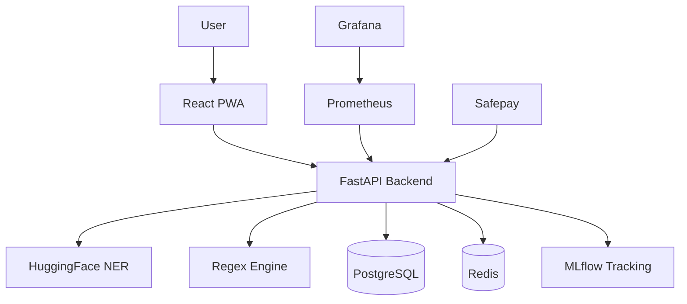

# MyCyber DLP
## AI-powered Data Leakage Prevention for Pakistan

[Screenshot placeholder — add after deployment]

> Stop data leaks before they cost you.
> Detect CNIC, emails, API keys, and 6 more
> sensitive data types across text, files,
> and network traffic in under 1 second.

## 🔴 Live Demo
[https://mycyber.pk](https://mycyber.pk) — try
the free plan, no credit card required.

## Launch Readiness Update (Apr 2026)

- Marketing landing page added at / with pricing, FAQ, and trust sections.
- Legal pages live at /privacy and /terms.
- First-run onboarding flow added for new users after registration.
- Human-readable API error responses implemented for common failures.
- Production security headers and root health redirect are enabled.
- Phased MFA backend flow added (`off`, `opt_in`, `enforced`) with TOTP endpoints.
- Login lockout and suspicious-login audit events are now recorded.
- Admin incident APIs and dashboard route added for response actions.

## Why MyCyber?

Pakistani businesses face unique data privacy risks:
CNIC numbers, Easypaisa/JazzCash credentials,
and HBL/UBL IBANs are routinely leaked in emails,
spreadsheets, and API responses. Existing DLP tools
cost $50,000+/year and are built for US/EU markets.

MyCyber detects Pakistan-specific PII starting at
PKR 4,500/month.

## What we detect

| Entity Type | Example | Severity |
|------------|---------|----------|
| CNIC | 42101-1234567-1 | CRITICAL |
| Credit Card | 4111-1111-1111-1111 | CRITICAL |
| API Key | sk-proj-abc123... | CRITICAL |
| Password | password=secret123 | CRITICAL |
| IBAN | PK36SCBL0000001123456702 | HIGH |
| Email | user@company.com | HIGH |
| Phone | +923001234567 | MEDIUM |
| IP Address | 192.168.1.100 | LOW |
| URL Token | ...?token=abc123 | HIGH |

## Plans & Pricing

| | Free | Pro | Enterprise |
|--|------|-----|-----------|
| Scans/month | 100 | 10,000 | Unlimited |
| File scanning | ✅ | ✅ | ✅ |
| Network scanning | ❌ | ✅ | ✅ |
| API access | ❌ | ✅ | ✅ |
| Email alerts | ✅ | ✅ | ✅ |
| Telegram alerts | ❌ | ✅ | ✅ |
| SLA | ❌ | 99% | 99.9% |
| Price | PKR 0 | PKR 4,500/mo | PKR 15,000/mo |

Payment via Safepay (JazzCash, Easypaisa, bank transfer)

## Architecture



## Quick start (Docker)

```bash
git clone https://github.com/Khan-Feroz211/MyCyber-Project
cp .env.docker.example .env.docker
# Edit .env.docker with your credentials
make up
# Open http://localhost
```

Default demo: http://localhost → Register → Run scan

## Tech stack

| Layer | Technology |
|-------|-----------|
| Backend | FastAPI + Python 3.11 |
| ML | HuggingFace BERT NER + regex hybrid |
| Database | PostgreSQL 16 + Redis 7 |
| Auth | JWT + bcrypt |
| MLOps | MLflow + Prometheus + Grafana |
| Frontend | React 18 + Tailwind CSS |
| Billing | Safepay Pakistan |
| Infra | Docker + Kubernetes + GitHub Actions |

## API (Pro/Enterprise)

```bash
# Scan text for PII
curl -X POST https://api.mycyber.pk/api/v1/scan/text \
  -H "Authorization: Bearer YOUR_TOKEN" \
  -H "Content-Type: application/json" \
  -d '{"text": "CNIC: 42101-1234567-1", "context": "general"}'
```

Full API docs: https://api.mycyber.pk/docs

## Make commands

| Command | Description |
|---------|-------------|
| make up | Start all services |
| make down | Stop all services |
| make logs | Follow all logs |
| make migrate | Run DB migrations |
| make test | Run all tests |

## Security

- All data encrypted in transit (TLS)
- Scan content processed in memory (not stored)
- JWT auth with bcrypt password hashing
- Phased MFA + account lockout controls
- Security audit event pipeline for login and admin actions
- Admin incident response endpoints for lock/unlock/deactivate/reactivate
- Kubernetes NetworkPolicy (zero-trust)
- GitHub Actions security scanning (Bandit + Trivy)
- See [security page](https://mycyber.pk/security)
- Ops checklist: `docs/SECURITY_BACKUP_RESTORE_CHECKLIST.md`
- Hardening helper script: `scripts/security-hardening-checklist.sh`

## Built by

Feroz Khan — AI Engineering student at NUTECH Islamabad
GitHub: github.com/Khan-Feroz211
LinkedIn: linkedin.com/in/feroz-khan
Email: feroz@mycyber.pk
